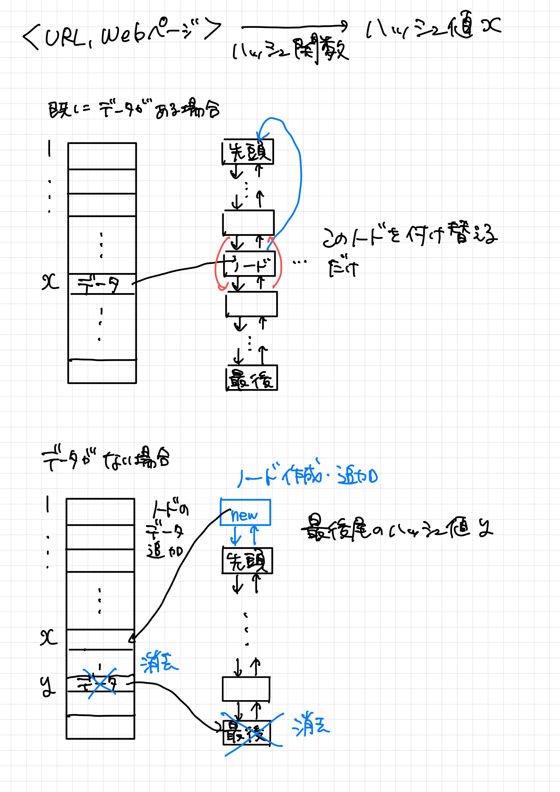
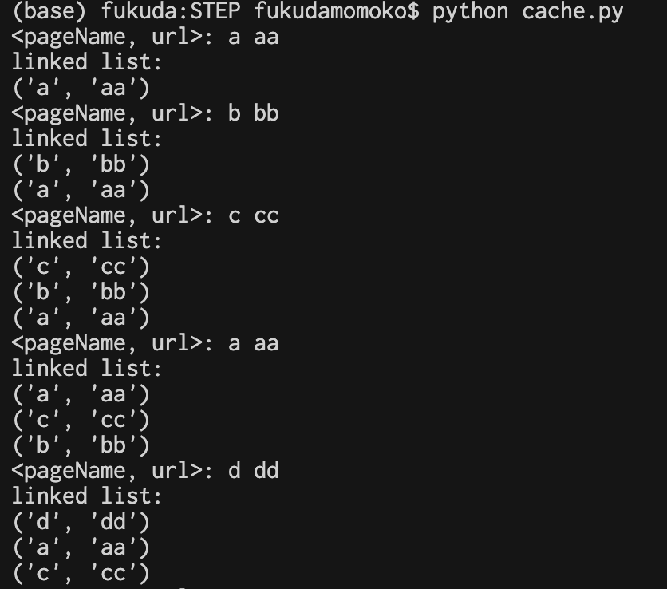
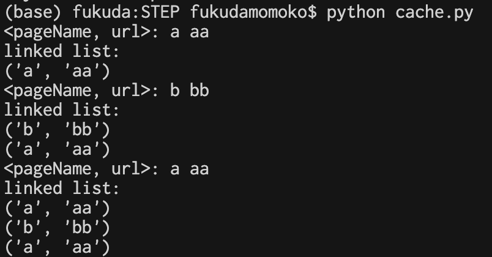

## 宿題１

code: matrix.py

行列の計算部分には3重ループが必要になるので，正方行列の次数をNとすると，行列の計算量はO(N^3)となる。

Nと実行時間の関係のグラフは以下のようになっている。

グラフからも行列の計算量がO(N^3)になっていることがわかる。

## 宿題２

ハッシュテーブルより木構造が好まれる理由として，以下の二つを考えた。

- ハッシュテーブルは大きな配列が必要になるため，使用するとメモリ消費が大きくなり，動作が重くなり逆に低速になってしまうから
- ALEX_COMMENT:　メモリ消費と低速の関係性、説明できますか。ヒント：メモリ消費が上がっても、低速にならないケースが多いのです。
- できるだけ衝突を避けるようなハッシュ関数を選ぶのが難しいから

## 宿題３

直近にアクセスされた上位X個のページを保存するデータ構造として，ハッシュテーブルと双方向連結リストを使った以下のようなものを考えた。  
ハッシュテーブルにはリストのノードを保存し，ノードにはページのデータ（<URL, Webページ>）をそれぞれ保存する。 
- ページを訪れた時，そのページのハッシュ値に既にノードのデータがあり，そのノードがリストの中にあれば，リストの先頭に付け替える。
- ハッシュテーブルにデータがない，またはデータはあるがリストの中にない時，ノードを新しく作り先頭に加え，最後尾のものは捨てる。最後尾のノードが持つデータのハッシュ値を求め，ハッシュテーブルから最後尾のノードのデータを消す。

# ALEX_COMMENT 説明がわかりやすいと思います。なお、連結リストの最大サイズ（制限）が指定されていません。また、既存のリストがその最大サイズ以下の場合の動作も、説明されていません。

参考図

## 宿題４

X個の<URL, Webページ>を保存する(今回はX=3とした)ため，宿題3で述べたようなデータ構造を実装した。 

しかし，実装してみると，連結リストの長さがX以下なのかどうかを数える必要があり，その工程でO(X)の実行時間がかかってしまった。

また，仕組みが分かりやすいように，webページの名前とurlを入力すると連結リストの中身を出力するようにしました。結果は以下のようになった。構造としては望ましいものができたと思う。

しかし，以下のようにリストの長さがX以下の時，望ましくない挙動をしてしまった。この部分は，修正が難しくできなかった。

