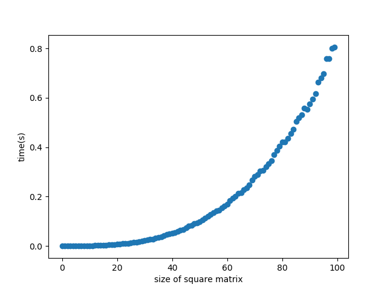

## 宿題１

code: matrix.py

行列の計算部分には3重ループが必要になるので，正方行列の次数をNとすると，行列の計算量はO(N^3)となる。

Nと実行時間の関係のグラフは以下のようになっている。

グラフの形は`y=x^3`になっており，グラフからも行列の計算量がO(N^3)になっていることがわかる。

## 宿題２

- ハッシュテーブルは大きな配列が必要になるため，使用するとメモリ消費が大きくなり，動作が重くなり逆に低速になってしまうから
- できるだけ衝突を避けるようなハッシュ関数を選ぶのが難しい

## 宿題３

直近にアクセスされた上位X個のページを保存するデータ構造として，ハッシュテーブルと双方向連結リストを使った以下のようなものを考えた。 
ハッシュテーブルにはリストのノードを保存し，ノードにはページのデータ（<URL, Webページ>）をそれぞれ保存する。
ページを訪れた時，そのページのハッシュ値に既にノードのデータがあれば，リストの先頭に付け替える。ハッシュテーブルにデータがなければ，ノードを新しく作り先頭に加え，最後尾のものは捨てる。最後尾のノードが持つデータのハッシュ値を求め，ハッシュテーブルから最後尾のノードのデータを消す。

参考図

