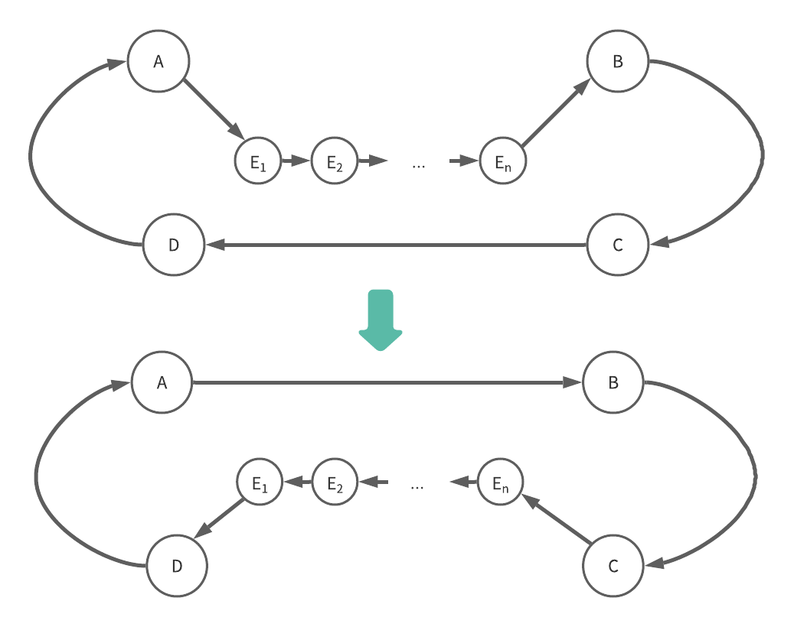

<!-- memo: c言語でのファイルの読み込み質問する -->

# HW1

- i-j-k: c[i * n + j]は飛び飛びにならないが, a[i * n + k]はn回ごとに飛び飛びになる（ただし以前見たところを再び参照する）, b[k * n + j]は毎回飛び飛びになる
- i-k-j: 飛び飛びにならない
- j-i-k: a[i * n + k]は飛び飛びにならないが, c[i * n + j]はn回ごとに飛び飛びになり, b[k * n + j]は毎回飛び飛びになる（ただしn回ごとに以前見たところを再び参照する）
- j-k-i: b[k * n + j]はn回ごとに飛び飛びになり，a[i * n + k], c[i * n + j]は毎回飛び飛びになる（ただしcはn回ごとに以前見たところを再び参照する）
- k-i-j: c[i * n + j]は飛び飛びにならないが，a[i * n + k], b[k * n + j]はn回ごとに飛び飛びになる（ただしbは以前見たところを再び参照する）
- k-j-i: b[k * n + j]は飛び飛びにならないが，c[i * n + j], a[i * n + k]は毎回飛び飛びになる（ただしaはn回ごとに以前見たところを再び参照する）

飛び飛びになる回数が多いほど実行時間が長くなると考えられるので，予想は以下のようになる。 
i-k-j < k-i-j < i-j-k = j-i-k < k-j-i = j-k-i

実際に実行したところ以下の表のようになった。
N=500で計測

|   Order   |    Time    |
| --------- | ---------- |
|   i-j-k   | 0.407903s  |
|   i-k-j   | 0.315041s  |
|   j-i-k   | 0.391561s  |
|   j-k-i   | 0.423588s  |
|   k-i-j   | 0.320074s  |
|   k-j-i   | 0.436269s  |

i-k-j < k-i-j < j-i-k < i-j-k < j-k-i < k-j-i
 
概ね予想通りになった。

# HW2

- 元々の速度が遅いので，ループ順序による影響が小さい

#HW3

1. pythonで書いていたコードをc++で書き直し，solve関数のループを100から300に増やした。(tsp.cc)経路のうち交差している部分をほどくようなやり方で最短経路を求める。
   
  **結果**

  |   Challenge   | python score | c++ score |
  | ------------- | ------------ | --------- |
  |   3 (N=64)    |   8527.83    |  8527.82  |
  |   4 (N=128)   |   11620.29   |  11620.29 |
  |   5 (N=512)   |   21741.37   |  21741.37 |
  |   6 (N=2048) |   44738.89   |  44738.89 |

  変化はなかった。
  この方法で求められた経路に交差はできていなかったので，2-optではこれ以上距離を縮めることができない。別の方法で最短距離を求める必要がある。

2. Hinako Katafuchiさんのコードを参考に，以下の図のように道順を変更する関数exchange_subsequence_nodeを追加した。

  
   
  **結果**

  |   Challenge   | python score | c++ score |
  | ------------- | ------------ | --------- |
  |   3 (N=64)    |   8527.83    |  8494.91  |
  |   4 (N=128)   |   11620.29   |  11351.17 |
  |   5 (N=512)   |   21741.37   |    |
  |   6 (N=2048)  |   44738.89   |    |
  ※O(N^4)なのでN=512以降は計算量が大きくなってしまい計測できなかった。